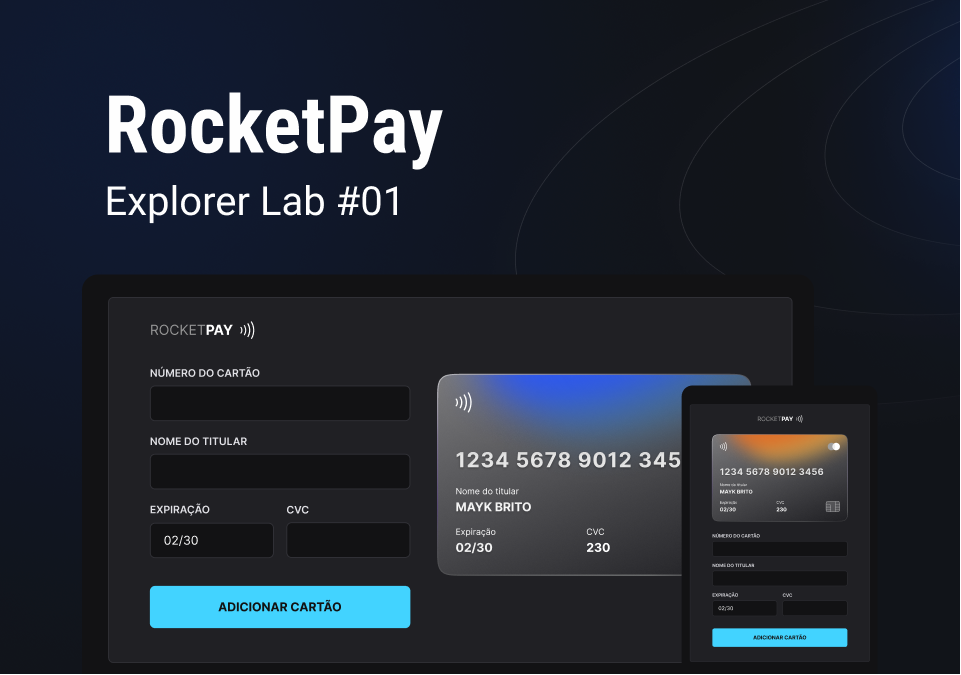

<h1 align="center">RocketPay</h1>

  

</img>

 

## 💻 Projeto

O Rocketpay é um componente que simula o formulário de preenchimento de cartão de crédito, onde é possível adicionar máscara aos inputs e atualizar elementos do HTML via DOM. Este projeto foi construido no [Explore Lab 01](https://github.com/rocketseat-education/explorer-lab-01) da Rocketseat.

## ✨ Tecnologias

Esse projeto foi desenvolvido com as seguintes tecnologias:

- [HTML](https://developer.mozilla.org/pt-BR/docs/Web/HTML)
- [JavaScript](https://developer.mozilla.org/pt-BR/docs/Web/JavaScript)
- [CSS](https://developer.mozilla.org/pt-BR/docs/Web/CSS)
- [iMask](https://developer.mozilla.org/pt-BR/docs/Web/CSS)
- [Vite](https://vitejs.dev/)

## 🚀 Como executar
- Clone o repositório
- Rode `npm install` para instalar as dependências
- Rode o `npm run dev` para iniciar a aplicação na porta <b>3000</b>
- Por fim, o <b>Website</b> estará disponível em `http://localhost:3000`

## 📄 Licença

Esse projeto está sob a licença MIT. Veja o arquivo [LICENSE](LICENSE) para mais detalhes.
